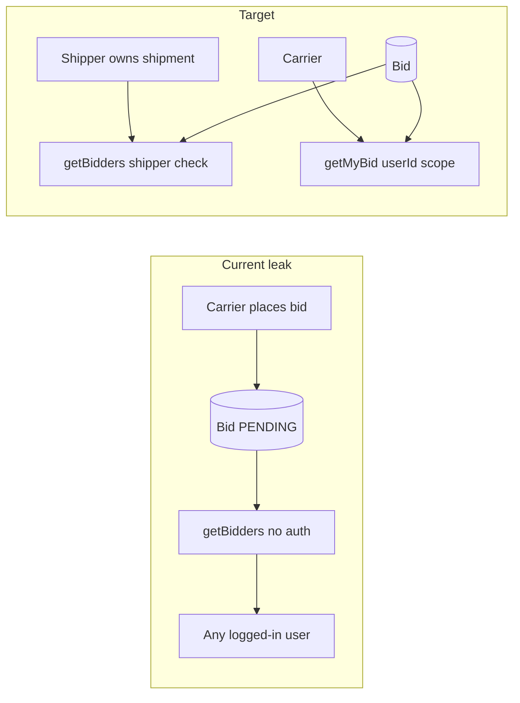

# Agent guide: bid visibility privacy fix

This document tells implementers (human or AI) **exactly what to change** so carriers cannot see competitor bids. Read the rollout and test steps in [plan.md](./plan.md). For data model context, see [DATABASE.md — Shipment & Bidding](./DATABASE.md#3-shipment--bidding) and the [BIDDING lifecycle](./DATABASE.md#3-bidding).

---

## Issue summary

**Expected behavior:** Only the **shipper who owns a shipment** may see all pending bids (amount, carrier name, phone). Each **carrier** may see **only their own** bid on a load.

**Current behavior:** When any carrier places a bid, other carriers (or any logged-in user who knows a `shipmentId`) can see competitor bids because `getBidders` returns all `PENDING` bids with no authorization check.

---

## Architecture context

- Bids are stored in Postgres via Prisma (`Bid` model). See [DATABASE.md — `Bid`](./DATABASE.md#bid).
- There is **no** row-level security (RLS); all access control must be in application code.
- Server actions in `src/features/bids/actions.ts` are **not bound to UI** — any client can invoke them if exported.
- Shipper bid UI polls via SWR every 5 seconds (`Bidders.tsx`); there are no websockets.



---

## Root cause

| # | Location | Problem |
|---|----------|---------|
| 1 | `src/features/bids/actions.ts` — `getBidders` | No `auth()` or `shipment.shipperId` check; returns all pending bids + carrier PII |
| 2 | Same file — `placeBid` | Only requires login; no `role === "carrier"` or closed-shipment check |
| 3 | `app/dashboard/carrier/find_loads/page.tsx` | Prisma `include: { bids: ... }` loads **every** bid on every open shipment server-side |
| 4 | `src/components/ui/Table.tsx` | `<Bidders id={id} />` mounted for every row; SWR polls `getBidders` even when modal is closed |
| 5 | Dashboard routing | No role guard on `/dashboard/shipper/*`; carriers can open shipper bid pages |

**What is already correct (do not break):** `selectBidder` and `declineBid` verify `shipment.shipperId === session.user.id` before mutating bids. Mirror this pattern for reads.

---

## Required code changes (in order)

### 1. Secure `getBidders` (P0)

**File:** `src/features/bids/actions.ts`

Before `findMany`, add the same ownership check used in `declineBid`:

```typescript
export const getBidders = async (shipmentId: number) => {
  const session = await auth();
  const shipperId = session?.user?.id;

  if (!shipperId) {
    return [];
  }

  const shipment = await prisma.shipment.findUnique({
    where: { id: shipmentId },
    select: { shipperId: true },
  });

  if (!shipment || shipment.shipperId !== shipperId) {
    return [];
  }

  const bids = await prisma.bid.findMany({
    where: { shipmentId, status: "PENDING" },
    orderBy: { createdAt: "desc" },
    include: {
      user: {
        select: { id: true, name: true, phoneNumber: true },
      },
    },
  });

  return bids;
};
```

- Return `[]` for unauthorized callers (avoid leaking whether bids exist).
- Do **not** change the return shape for authorized shippers — `Bidders.tsx` depends on it.

### 2. Add `getMyBid` for carriers (P0, if needed)

**File:** `src/features/bids/actions.ts`

If any carrier UI needs bid status via a server action:

```typescript
export const getMyBid = async (shipmentId: number) => {
  const session = await auth();
  const userId = session?.user?.id;

  if (!userId) {
    return null;
  }

  return prisma.bid.findFirst({
    where: { shipmentId, userId },
    select: { amount: true, status: true },
  });
};
```

Never return other users' bids from this action.

### 3. Tighten `find_loads` query (P0)

**File:** `app/dashboard/carrier/find_loads/page.tsx`

Replace:

```typescript
bids: { select: { id: true, userId: true, amount: true, status: true } },
```

With:

```typescript
bids: {
  where: { userId },
  select: { amount: true, status: true },
},
```

- Remove `bids: s.bids.map((b) => String(b.id))` from `parsedShipments` if nothing in `FindLoads` / `FindLoad` consumes it.
- Keep `myBidAmount` / `myBidStatus` derived from the scoped `bids` array.

### 4. Harden `placeBid` (P1)

**File:** `src/features/bids/actions.ts`

After login check:

```typescript
if (session.user.role !== "carrier") {
  return fail("Only carriers can place bids");
}

if (shipment.acceptedBidId) {
  return fail("This shipment already has an accepted bid");
}
```

Also add:

```typescript
revalidatePath("/dashboard/shipper/active_bids");
```

alongside the existing `revalidatePath("/dashboard/carrier/find_loads")`.

### 5. Lazy-mount `Bidders` in Table (P1)

**File:** `src/components/ui/Table.tsx`

Today `Bidders` is always rendered inside `ModalProvider.Window`, so SWR runs for every table row. Only mount `<Bidders />` when the bidders modal is open (follow existing `ModalProvider` open state), or pass a flag so `Bidders` does not call `useSWR` until the modal opens.

**File:** `src/features/shipper/components/Bidders.tsx` (if needed)

Gate the SWR key: `useSWR(enabled ? ["bidders", id] : null, ...)`.

### 6. Dashboard role protection (P1)

Add middleware or a layout check so:

- `/dashboard/shipper/*` → `role === "shipper"`
- `/dashboard/carrier/*` → `role === "carrier"`

Redirect or 403 on mismatch. This blocks carriers from using shipper pages as a workaround.

---

## Files to modify

| File | Change |
|------|--------|
| `src/features/bids/actions.ts` | Auth on `getBidders`; optional `getMyBid`; harden `placeBid` |
| `app/dashboard/carrier/find_loads/page.tsx` | Scope `bids` include to current user |
| `src/components/ui/Table.tsx` | Lazy `Bidders` mount |
| `src/features/shipper/components/Bidders.tsx` | Optional SWR enable gate |
| `middleware.ts` or `app/dashboard/layout.tsx` | Role-based route guard (P1) |

---

## Do not

- Add new server actions that return all bids without a `shipperId` ownership check.
- Pass competitor `amount`, `userId`, or PII to carrier client components or RSC props.
- Remove or weaken `selectBidder` / `declineBid` ownership checks.
- Rely on hiding data in the UI only — server actions and Prisma queries must enforce scope.
- Log competitor bid amounts in carrier-facing code paths.

---

## Agent verification checklist

Run after implementing P0 (and P1 if in scope). Full manual steps are in [plan.md — Test plan](./plan.md#test-plan).

- [ ] `getBidders` returns bids only when `session.user.id === shipment.shipperId`
- [ ] Carrier session calling `getBidders` for another user's shipment gets `[]` (no names, amounts, or phones)
- [ ] Carrier Find Loads shows only own `myBidAmount` / `myBidStatus`
- [ ] `find_loads` RSC/network payload has no other carriers' bid amounts
- [ ] Shipper Active Bids → View Bids still lists all pending bidders
- [ ] Accept / decline bid still works for the owning shipper
- [ ] Duplicate bid still surfaces P2002 / "already placed" message
- [ ] (P1) Non-shipper cannot access `/dashboard/shipper/active_bids` meaningfully

---

## Related documentation

- [plan.md](./plan.md) — phased rollout, code review gates, manual test matrix
- [DATABASE.md](./DATABASE.md) — `Bid` model, constraints, bidding lifecycle
