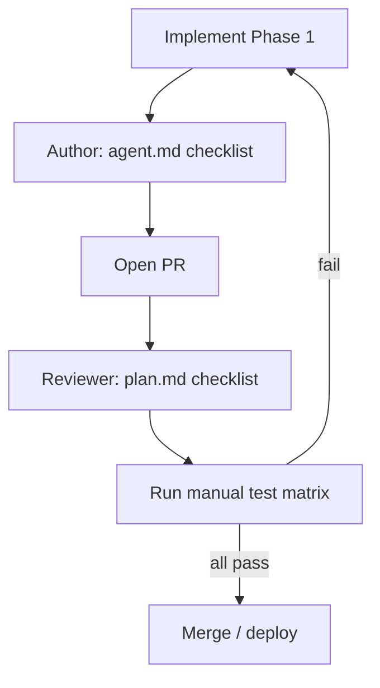

# Plan: fix bid visibility leak

Carriers can currently see competitor bids (amount, name, phone) when any carrier places a bid on a shipment. This plan describes how to fix, review, and test the issue before release.

**Implementation details:** [agent.md](./agent.md)  
**Data model:** [DATABASE.md — Shipment & Bidding](./DATABASE.md#3-shipment--bidding), [BIDDING lifecycle](./DATABASE.md#3-bidding)

---

## Goals

| Goal | Success criteria |
|------|------------------|
| Shipper privacy | Owning shipper sees all pending bids on their shipments |
| Carrier isolation | Each carrier sees only their own bid amount/status on a load |
| No API leak | `getBidders` and RSC payloads never expose competitor data to non-shippers |
| No regression | Accept, decline, place bid, and Find Loads continue to work |

---

## Problem statement

Competitive bidding requires that carriers **cannot** see each other's offers until a shipper accepts one. Today:

1. `getBidders(shipmentId)` returns every `PENDING` bid with carrier PII and has **no authorization**.
2. `find_loads` loads all bids server-side (UI filters to "my" bid, but the query is over-broad).
3. `Bidders` polls `getBidders` every 5 seconds; any user who can trigger that action sees new bids immediately.
4. Shipper dashboard routes are not role-protected, so carriers can open shipper bid views.

---

## Phased implementation

### Phase 1 — Secure read path (P0) — ship first

**Priority:** Must ship together; closes the main leak.

| Task | File | Action |
|------|------|--------|
| 1.1 | `src/features/bids/actions.ts` | Add `auth()` + `shipment.shipperId` check to `getBidders`; return `[]` if unauthorized |
| 1.2 | `src/features/bids/actions.ts` | Add `getMyBid(shipmentId)` scoped to `session.user.id` (if any client needs it) |
| 1.3 | `app/dashboard/carrier/find_loads/page.tsx` | Scope Prisma `bids` include to `{ where: { userId } }`; drop unused `bids: string[]` prop |

**Exit criteria:** Manual tests 1–7 (below) pass for read isolation.

See step-by-step code in [agent.md](./agent.md#required-code-changes-in-order).

### Phase 2 — Harden writes and routes (P1)

| Task | File | Action |
|------|------|--------|
| 2.1 | `src/features/bids/actions.ts` | `placeBid`: require `role === "carrier"`; reject if `acceptedBidId` set |
| 2.2 | `src/features/bids/actions.ts` | `revalidatePath("/dashboard/shipper/active_bids")` on `placeBid` |
| 2.3 | `src/components/ui/Table.tsx` | Mount `<Bidders />` only when bid modal is open |
| 2.4 | `middleware.ts` or dashboard layout | Block wrong role from `/dashboard/shipper/*` and `/dashboard/carrier/*` |

**Exit criteria:** Manual test 8 passes; no background `getBidders` polling on closed modals.

### Phase 3 — Review and sign-off

Complete the [code review checklist](#code-review-checklist) and [test plan](#test-plan) before merging to main or deploying.

---

## Code review checklist

Reviewer confirms each item before merge:

- [ ] `getBidders` returns full bid list **only** when `session.user.id === shipment.shipperId`
- [ ] Unauthenticated or wrong-shipper callers get `[]` — never partial competitor data
- [ ] Carrier pages and RSC payloads do not include other carriers' `userId`, `amount`, name, or phone
- [ ] `placeBid` rejects non-carriers and shipments with `acceptedBidId` (P1)
- [ ] No new server action returns all bids without an ownership check
- [ ] `selectBidder` and `declineBid` ownership logic unchanged
- [ ] `find_loads` Prisma query uses `bids: { where: { userId } }`

---

## Test plan

Run on **local** or **staging** with at least three accounts: Shipper A, Carrier B, Carrier C.

### Setup

1. Sign in as **Shipper A**.
2. Create a shipment (post a load) and note the shipment appears under **Active Bids**.
3. Open two separate browsers (or profiles): one for **Carrier B**, one for **Carrier C**.

### Manual test matrix

| # | Actor | Steps | Expected result | Pass |
|---|--------|--------|-----------------|------|
| 1 | Shipper A | Active Bids → **View Bids** on the new shipment | Lists all pending bids with carrier name and phone (empty until carriers bid) | ☐ |
| 2 | Carrier B | Find Loads → place bid on Shipper A's load | Success message; UI shows **only B's** amount/status | ☐ |
| 3 | Carrier C | Place bid on the **same** load | Success; UI shows **only C's** amount — **not** B's amount | ☐ |
| 4 | Carrier C | DevTools → Network (or repeat View Bids if shipper UI were reachable): ensure no response contains B's bid amount or phone | No competitor bid data in responses | ☐ |
| 5 | Carrier B | Refresh Find Loads after C bid | Still **only B's** bid visible | ☐ |
| 6 | Shipper A | Refresh **View Bids** | Sees **both** B and C with amounts and contact info | ☐ |
| 7 | Shipper A | Accept B's bid | B's bid accepted; C's bid rejected; carriers see updated status for **self only** | ☐ |
| 8 | Carrier C | Navigate to `/dashboard/shipper/active_bids` (P1) | Redirected, 403, or page shows no bid data | ☐ |

### Regression checks

After P0/P1 changes, verify:

| Area | Steps | Expected |
|------|--------|----------|
| Decline bid | Shipper declines a pending bid | Bid removed from pending list; carrier can bid again if business rules allow |
| Duplicate bid | Same carrier bids twice on same load | Error: already placed (P2002) |
| Find Loads list | Carrier opens Find Loads | Open shipments still listed; own bid column correct |
| Accept flow | Shipper accepts bid | Job created; carrier sees active job; rejected carriers see rejection status for self only |

### Optional automated test (follow-up)

Add a Playwright or integration test:

1. Create shipment as shipper.
2. Place bids as Carrier B and Carrier C.
3. Assert Carrier C's session cannot read Carrier B's `amount` via `getBidders` or `find_loads` HTML/RSC payload.

Not required for v1 sign-off if manual matrix passes.

---

## Review workflow

1. **Author** implements Phase 1 per [agent.md](./agent.md).
2. **Author** runs [Agent verification checklist](./agent.md#agent-verification-checklist).
3. **PR** description links this plan and summarizes P0 vs P1 scope.
4. **Reviewer** completes [code review checklist](#code-review-checklist).
5. **QA / author** runs [manual test matrix](#manual-test-matrix) and marks Pass column.
6. **Merge** only when all P0 checklist items and tests 1–7 pass.

---

## Definition of done

- [ ] Phase 1 (P0) merged
- [ ] All [code review checklist](#code-review-checklist) items checked
- [ ] Manual tests **1–7** pass
- [ ] No competitor bid amounts or PII in carrier browser Network tab for `getBidders` or Find Loads page load
- [ ] Phase 2 (P1) scheduled or merged if agreed in scope
- [ ] (Optional) Automated test ticket created

---

## Related documentation

- [agent.md](./agent.md) — file-level fixes and code snippets for implementers
- [DATABASE.md](./DATABASE.md) — `Bid` model, `@@unique([userId, shipmentId])`, bidding lifecycle
