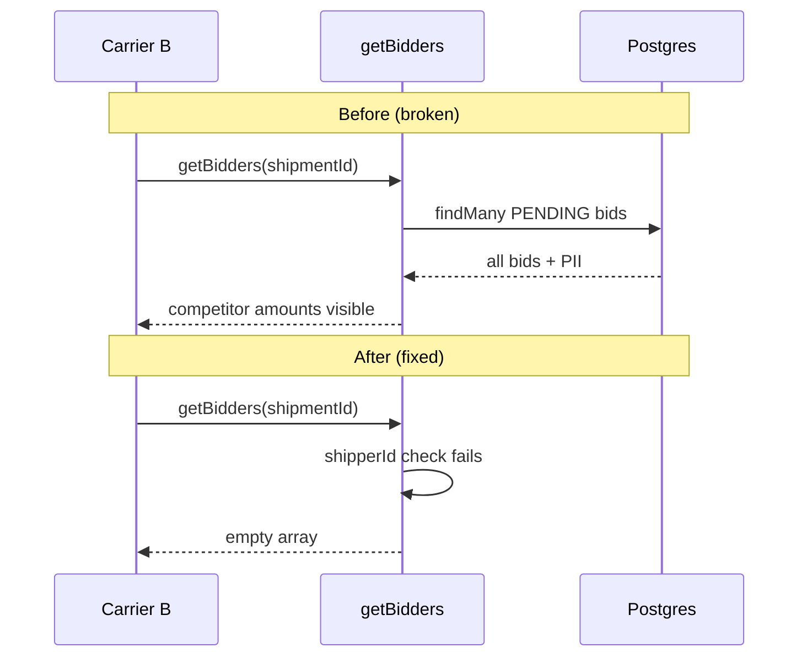
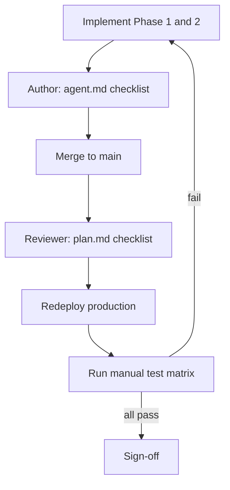

# Plan: fix bid visibility leak

**Status:** Implemented in codebase (commit `seller-issues-fixes` on `main`).  
**Production:** Requires a **redeploy** on your host after `main` is deployed — changes are not live until the host builds the latest commit.

**Implementation details:** [agent.md](./agent.md)  
**Data model:** [DATABASE.md — Shipment & Bidding](./DATABASE.md#3-shipment--bidding), [BIDDING lifecycle](./DATABASE.md#3-bidding)

---

## Implementation status (summary)

| Phase | Status | Notes |
|-------|--------|--------|
| Phase 1 — Secure read path (P0) | **Done** | `getBidders`, `getMyBid`, scoped `find_loads` |
| Phase 2 — Harden writes and routes (P1) | **Done** | `placeBid` guards, `middleware.ts`, SWR gate on `Bidders` |
| Phase 3 — Review and sign-off | **In progress** | Code review done in repo; **manual QA pending** |
| Production auth fix | **Done** | Middleware cookie name + `trustHost` + SessionProvider + sign-in flow |
| Local build and lint (auth rollout) | **Done** | `npx next build` + `npm run lint` pass; middleware under Vercel 1 MB limit |
| Production deploy | **Pending** | Push to `main` and redeploy on Vercel after env vars are set |

### Files changed

| File | What was done |
|------|----------------|
| [`src/features/bids/actions.ts`](../src/features/bids/actions.ts) | `getBidders` shipper-only; `getMyBid` added; `placeBid` carrier + closed-shipment checks; revalidate active bids |
| [`app/dashboard/carrier/find_loads/page.tsx`](../app/dashboard/carrier/find_loads/page.tsx) | Bids scoped to `userId`; only open shipments; removed `bids: string[]` from client props |
| [`src/features/carrier/components/FindLoads.tsx`](../src/features/carrier/components/FindLoads.tsx) | Removed unused `bids` from `LoadItem` type |
| [`src/features/shipper/components/Bidders.tsx`](../src/features/shipper/components/Bidders.tsx) | SWR only runs when `enabled` is true (default `true`; modal still lazy-mounts via `Modal.Window`) |
| [`middleware.ts`](../middleware.ts) | Role-based dashboard protection; `getToken` with production cookie name |
| [`src/features/auth/auth.ts`](../src/features/auth/auth.ts) | `trustHost: true`; session from JWT token (no DB per request) |
| [`src/components/providers/SessionProvider.tsx`](../src/components/providers/SessionProvider.tsx) | Wraps app for `next-auth/react` sign-in |
| [`src/features/auth/components/SignInForm.tsx`](../src/features/auth/components/SignInForm.tsx) | Role redirect, `router.refresh()`, `finally` resets pending |
| *(removed)* `middeleware.ts` | Typo file was never loaded by Next.js; replaced by `middleware.ts` |
| [`docs/agent.md`](./agent.md) | Implementer guide (unchanged scope) |

### Build verification (local)

- `next build` — passed  
- `eslint` — passed  
- No Prisma migration required (application-level fix only)

#### Auth rollout sign-off (local CI)

Run these before merging or tagging a release (PowerShell uses `;` instead of `&&`):

```powershell
cd path\to\Luggizztik\Luggizztik
npx next build
npm run lint
```

**Last verified (repo):** `npx next build` and `npm run lint` both exit **0**. Build output reports **Middleware ~45.2 kB** (well under Vercel Hobby’s **1 MB** Edge limit). No Prisma/bcrypt Edge warnings when middleware does not import `auth.ts`.

**After deploy:** run the [Production auth test matrix](#production-auth-test-matrix) (A1–A8) and the [manual test matrix](#manual-test-matrix) (1–8) on the live URL in an incognito window.

---

## Goals

| Goal | Success criteria | Code status |
|------|------------------|-------------|
| Shipper privacy | Owning shipper sees all pending bids on their shipments | Implemented |
| Carrier isolation | Each carrier sees only their own bid amount/status on a load | Implemented |
| No API leak | `getBidders` and RSC payloads never expose competitor data to non-shippers | Implemented |
| No regression | Accept, decline, place bid, and Find Loads continue to work | **Verify manually** |

---

## Problem statement (original)

Competitive bidding requires that carriers **cannot** see each other's offers until a shipper accepts one. **Before the fix:**

1. `getBidders(shipmentId)` returned every `PENDING` bid with carrier PII and had **no authorization**.
2. `find_loads` loaded all bids server-side (UI filtered to "my" bid, but the query was over-broad).
3. `Bidders` polled `getBidders` every 5 seconds; any user who could call that action saw new bids.
4. Shipper dashboard routes were not role-protected (`middeleware.ts` was misspelled and never ran).

**After the fix:** `getBidders` is shipper-only; carrier pages only load the current user's bid; `middleware.ts` enforces dashboard roles.



---

## Phased implementation

### Phase 1 — Secure read path (P0) — **Done**

| Task | File | Action | Status |
|------|------|--------|--------|
| 1.1 | `src/features/bids/actions.ts` | Add `auth()` + `shipment.shipperId` check to `getBidders`; return `[]` if unauthorized | Done |
| 1.2 | `src/features/bids/actions.ts` | Add `getMyBid(shipmentId)` scoped to `session.user.id` | Done |
| 1.3 | `app/dashboard/carrier/find_loads/page.tsx` | Scope Prisma `bids` to `{ where: { userId } }`; drop `bids: string[]` prop | Done |

**Exit criteria:** Manual tests 1–7 pass for read isolation — **run on staging/production after deploy**.

See [agent.md](./agent.md#required-code-changes-in-order) for code reference.

### Phase 2 — Harden writes and routes (P1) — **Done**

| Task | File | Action | Status |
|------|------|--------|--------|
| 2.1 | `src/features/bids/actions.ts` | `placeBid`: require `role === "carrier"`; reject if `acceptedBidId` set | Done |
| 2.2 | `src/features/bids/actions.ts` | `revalidatePath("/dashboard/shipper/active_bids")` on `placeBid` | Done |
| 2.3 | `src/components/ui/Table.tsx` / `Bidders.tsx` | Avoid polling when modal closed — `Modal.Window` already returns `null` when closed; `Bidders` adds `enabled` prop for SWR | Done |
| 2.4 | `middleware.ts` | Block wrong role from `/dashboard/shipper/*` and `/dashboard/carrier/*` | Done |

**Exit criteria:** Manual test 8 passes after deploy.

### Phase 3 — Review and sign-off — **In progress**

Complete the [code review checklist](#code-review-checklist) and [test plan](#test-plan) on **staging or production** after redeploy.

---

## Code review checklist

Reviewer confirms each item (implementation verified in repo; production after deploy):

- [x] `getBidders` returns full bid list **only** when `session.user.id === shipment.shipperId`
- [x] Unauthenticated or wrong-shipper callers get `[]` — never partial competitor data
- [x] Carrier pages and RSC payloads do not include other carriers' `userId`, `amount`, name, or phone
- [x] `placeBid` rejects non-carriers and shipments with `acceptedBidId`
- [x] No new server action returns all bids without an ownership check
- [x] `selectBidder` and `declineBid` ownership logic unchanged
- [x] `find_loads` Prisma query uses `bids: { where: { userId } }`

---

## Test plan

Run on **local**, **staging**, or **production** (after redeploy) with at least three accounts: Shipper A, Carrier B, Carrier C.

### Setup

1. Sign in as **Shipper A**.
2. Create a shipment (post a load) and note the shipment appears under **Active Bids**.
3. Open two separate browsers (or profiles): one for **Carrier B**, one for **Carrier C**.

### Manual test matrix

| # | Actor | Steps | Expected result | Pass |
|---|--------|--------|-----------------|------|
| 1 | Shipper A | Active Bids → **View Bids** on the new shipment | Lists all pending bids with carrier name and phone (empty until carriers bid) | ☐ |
| 2 | Carrier B | Find Loads → place bid on Shipper A's load | Success message; UI shows **only B's** amount/status | ☐ |
| 3 | Carrier C | Place bid on the **same** load | Success; UI shows **only C's** amount — **not** B's amount | ☐ |
| 4 | Carrier C | DevTools → Network: no response contains B's bid amount or phone | No competitor bid data in responses | ☐ |
| 5 | Carrier B | Refresh Find Loads after C bid | Still **only B's** bid visible | ☐ |
| 6 | Shipper A | Refresh **View Bids** | Sees **both** B and C with amounts and contact info | ☐ |
| 7 | Shipper A | Accept B's bid | B's bid accepted; C's bid rejected; carriers see updated status for **self only** | ☐ |
| 8 | Carrier C | Navigate to `/dashboard/shipper/active_bids` | Redirected to `/dashboard/carrier` | ☐ |

### Regression checks

| Area | Steps | Expected | Pass |
|------|--------|----------|------|
| Decline bid | Shipper declines a pending bid | Bid removed from pending list | ☐ |
| Duplicate bid | Same carrier bids twice on same load | Error: already placed (P2002) | ☐ |
| Find Loads list | Carrier opens Find Loads | Open shipments listed; own bid column correct | ☐ |
| Accept flow | Shipper accepts bid | Job created; carriers see correct self status | ☐ |

### Optional automated test (follow-up)

- [ ] Playwright/integration test: two carrier sessions cannot read each other's bid amounts for the same `shipmentId`

Not required for v1 sign-off if manual matrix passes.

---

## Review workflow



| Step | Status |
|------|--------|
| 1. Implement Phase 1 & 2 per [agent.md](./agent.md) | Done |
| 2. Author runs [agent verification checklist](./agent.md#agent-verification-checklist) | Done (code-level) |
| 3. Merged to `main` (`seller-issues-fixes`) | Done |
| 4. Reviewer completes [code review checklist](#code-review-checklist) | Done (in repo) |
| 5. QA runs [manual test matrix](#manual-test-matrix) | **Pending** |
| 6. Redeploy production host | **Pending** |
| 7. Sign-off when tests 1–8 pass on deployed environment | **Pending** |

---

## Definition of done

- [x] Phase 1 (P0) merged
- [x] Phase 2 (P1) merged
- [x] All [code review checklist](#code-review-checklist) items checked (implementation)
- [ ] Manual tests **1–8** pass on staging/production **after redeploy**
- [ ] No competitor bid amounts or PII in carrier Network tab for `getBidders` / Find Loads (verify in browser)
- [ ] Production redeploy completed
- [ ] (Optional) Automated test ticket created

---

## Deploy to production

Code on `main` does **not** update production automatically unless your host auto-deploys on push.

1. Confirm latest commit is on `main` (`seller-issues-fixes` or later).
2. Trigger a **new deployment** on your host (Vercel, Netlify, VPS, etc.).
3. No `prisma migrate` needed for this fix.
4. Run the [manual test matrix](#manual-test-matrix) on the live URL.

### Middleware and Vercel Edge (1 MB limit)

Vercel Hobby plans cap Edge Functions at **1 MB**. Do **not** import [`auth.ts`](../src/features/auth/auth.ts) or Prisma in [`middleware.ts`](../middleware.ts) — that bundles bcrypt + Prisma and exceeds the limit.

[`middleware.ts`](../middleware.ts) uses **`getToken`** from `next-auth/jwt` only. In production you **must** pass the Auth.js v5 cookie name and salt:

| Environment | Cookie name |
|-------------|-------------|
| Local (HTTP) | `authjs.session-token` |
| Production (HTTPS) | `__Secure-authjs.session-token` |

JWT-only middleware is correct for size limits; production sign-in failed when `getToken` used the dev cookie name only. Do not revert to `auth()` in middleware.

Ensure **`AUTH_SECRET`** is identical in Vercel Production and used by both the auth API and middleware.

---

## Production authentication

Sign-in can work locally but fail on Vercel when middleware cannot read the session cookie, env vars are wrong, or the client never finishes the login UI flow.

### Root causes addressed in code

1. **Cookie name mismatch** — production uses `__Secure-authjs.session-token`; middleware now sets `cookieName` and `salt` accordingly.
2. **`trustHost`** — added to [`auth.ts`](../src/features/auth/auth.ts) for Vercel host/callback handling.
3. **Session callback DB round-trip** — session now hydrates from JWT `token` only (password still checked in `authorize()` at login).
4. **Missing `SessionProvider`** — added in [`app/layout.tsx`](../app/layout.tsx).
5. **Sign-in UI** — [`SignInForm.tsx`](../src/features/auth/components/SignInForm.tsx) redirects by role, calls `router.refresh()`, and always clears pending in `finally`.

### Vercel environment checklist

Before sign-off on production:

- [ ] **`AUTH_SECRET`** — set for Production (generate: `node -e "console.log(require('crypto').randomBytes(32).toString('base64'))"`).
- [ ] **`DATABASE_URL`** — pooled URL (e.g. copy from `*_PRISMA_DATABASE_URL` integration var).
- [ ] **`DIRECT_URL`** — direct URL (e.g. copy from `*_POSTGRES_URL`).
- [ ] **`AUTH_URL`** (recommended) — `https://your-production-domain.vercel.app`.
- [ ] **Redeploy** after any env change.
- [ ] Test in **incognito** (old cookies invalid after `AUTH_SECRET` rotation).

### Production auth test matrix

Run on the **live URL** in incognito after redeploy:

| # | Test | Expected | Pass |
|---|------|----------|------|
| A1 | Sign in as shipper | Lands on `/dashboard/shipper` | ☐ |
| A2 | Sign out; sign in as carrier | Lands on `/dashboard/carrier` | ☐ |
| A3 | After login → DevTools → Cookies | `__Secure-authjs.session-token` on production domain | ☐ |
| A4 | Shipper visits `/dashboard/carrier` | Redirect to `/dashboard/shipper` | ☐ |
| A5 | Carrier visits `/dashboard/shipper/active_bids` | Redirect to `/dashboard/carrier` | ☐ |
| A6 | Logged out → `/dashboard/shipper` | Redirect to `/signin` | ☐ |
| A7 | Wrong password | Error toast; button leaves “Signing in…” | ☐ |
| A8 | Bid matrix tests 1–8 | No regression | ☐ |

**Troubleshooting**

| Symptom | Likely cause |
|---------|----------------|
| A1 fails, A3 cookie **present** | Middleware/env cookie fix not deployed |
| A1 fails, A3 cookie **missing** | `AUTH_SECRET`, `DATABASE_URL`, or auth API error — check Vercel function logs for `/api/auth/callback/credentials` |
| Stuck on “Signing in…” | Client pending state (fixed in code) or slow/hanging API |

---

## Related documentation

- [agent.md](./agent.md) — file-level fixes and code snippets for implementers
- [DATABASE.md](./DATABASE.md) — `Bid` model, `@@unique([userId, shipmentId])`, bidding lifecycle
